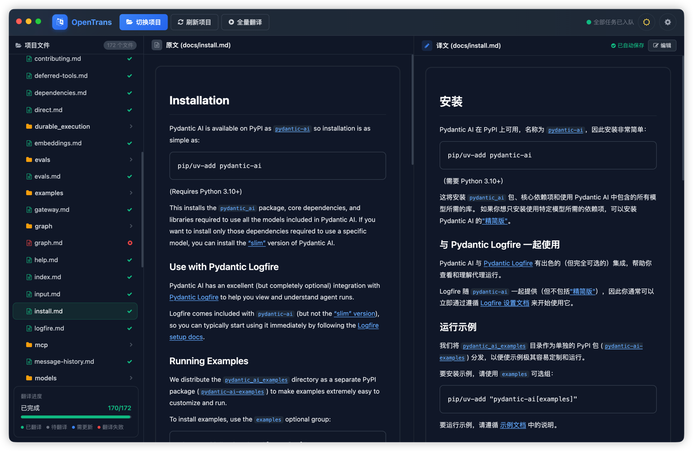
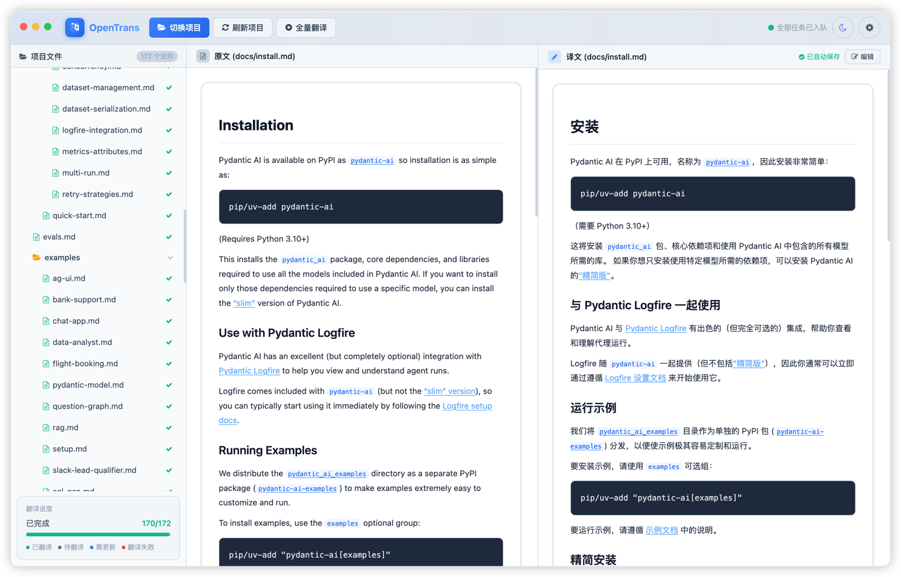

# OpenTrans

> 很多优秀的开源框架只有英文文档，机器翻译准确率低，在翻译网页和代码编辑器之间来回切换更是打断思路。OpenTrans 让你在本地用 AI 批量翻译项目 Markdown 文档，双栏对照原文阅读，告别上下文切换。


---

## 功能特性

- **批量翻译** — 一键将项目内所有 Markdown 文件加入翻译队列，支持自定义并发数
- **优先级插队** — 点击单个文件立即优先翻译，无需等待队列
- **双栏对照** — 左栏原文、右栏译文同屏对比，滚动联动同步
- **增量更新** — 记录每个文件的 sha256 Hash，源文件修改后自动标记为"需更新"
- **断点续翻** — 重新打开同一项目时跳过文件复制，直接恢复上次未完成的翻译任务
- **手动校对** — 双击译文进入编辑模式，失焦自动保存并更新 Hash
- **兼容任意 OpenAI 接口** — 支持自定义 Base URL，可接入 OpenAI、DeepSeek、Moonshot 等任意兼容接口
- **日间 / 夜间主题** — 一键切换，偏好持久化到本地

## 截图




## 下载安装

前往 [Releases](../../releases) 页面下载对应平台的安装包：

| 平台 | 文件 |
|------|------|
| macOS (Apple Silicon / Intel) | `OpenTrans-x.x.x.dmg` |
| Windows | `OpenTrans-Setup-x.x.x.exe` |
| Linux | `OpenTrans-x.x.x.AppImage` / `.deb` |

## 快速上手

1. 打开 OpenTrans，点击右上角 **⚙ 设置**，填入 API Base URL、API Key 和模型名称
2. 点击 **选择项目**，选择一个包含 `.md` 文件的本地目录
3. 程序会在同级目录创建 `{项目名}-translator/` 作为工作目录
4. 点击 **全量翻译** 将所有未翻译文件加入队列；或点击左侧文件树中的单个文件立即优先翻译
5. 右栏译文翻译完成后，双击可进入编辑模式手动校对，失焦自动保存

### 文件状态说明

| 图标颜色 | 含义 |
|----------|------|
| 🟢 绿色  | 已翻译 |
| ⚫ 灰色  | 待翻译 |
| 🔵 蓝色  | 源文件已修改，需重新翻译 |
| 🟡 黄色  | 翻译中 |
| 🔴 红色  | 翻译失败 |

## 本地开发

```bash
# 克隆仓库
git clone https://github.com/CoderXiaopang/opentrans.git
cd opentrans

# 安装依赖
npm install

# 启动开发模式
npm run dev
```

### 打包

```bash
# macOS (.dmg)
npm run build:mac

# Windows (.exe)
npm run build:win

# Linux (.AppImage / .deb)
npm run build:linux
```


## 技术栈

| 层 | 技术 |
|----|------|
| 运行时 | Electron 28 |
| 前端 | React 18 + Tailwind CSS v3 |
| 构建 | electron-vite + Vite 5 |
| 状态管理 | Zustand |
| Markdown 渲染 | markdown-it |
| 翻译并发 | Worker Threads |
| 打包 | electron-builder |

## 许可证

[MIT](LICENSE)
